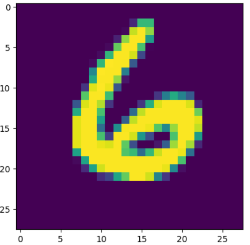
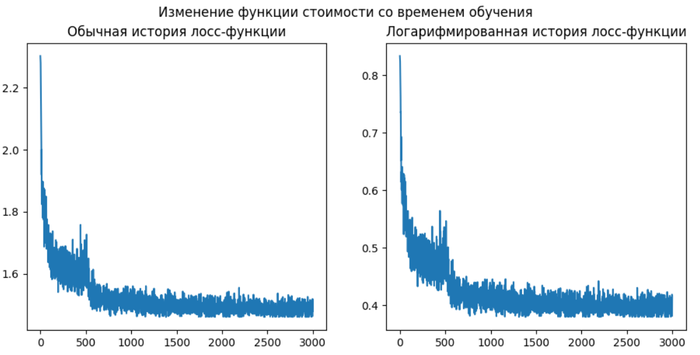

# mnist-classification
**Задача**: классификации изображений с набора данных MNIST

#### Схема работы программы:

        1) При обучении автоматически генерировать набор обучающих данных, затем
    обучать сеть на нём. Архитектура задаётся заранее.
        2) При тестировании работы сети также автоматически генерировать набор
    обучающих данных, и выдавать необходимый результат в консоли с выводом
    графиков.
        
**Порядок выполнения программы**: загрузка всех необходимых модулей,
загрузка данных из датасета и разбиение их на батчи.
Описание архитектуры нейронной сети. Выбор оптимизатора и
лосс-функции. Обучение по эпохам и батчам. Тестируем
качество нейронной сети на обучающей и тестовой выборках.

Пример входных данных:

Архитектура нейронной сети состоит из трёх
слоёв: 2 скрытых и один выходной.
В качестве функции активации скрытых слоёв 
выбран ReLU вместо сигмоиды, так как решает проблему
исчезающего градиента. Ссылка на источник
с объяснениями: https://machinelearningmastery.com/rectified-linear-activation-function-for-deep-learning-neural-networks.
Функция активации последнего слоя выдаёт
вероятности классов. Это обеспечивается
функцией SoftMax. Loss-функцией является
кросс-энтропия, так как перед нами стоит
задача многоклассовой классификации. Adam
выбран в качестве оптимизатора.

На заданных параметрах (размер батча = 100,
количество эпох = 5, количество узлов
в скрытых слоях = 512) получены следующие
результаты:

* Точность на тестовой выборке: 97.2%
* Среднее значение loss-функции на 
тестовой выборке: 1.489885

